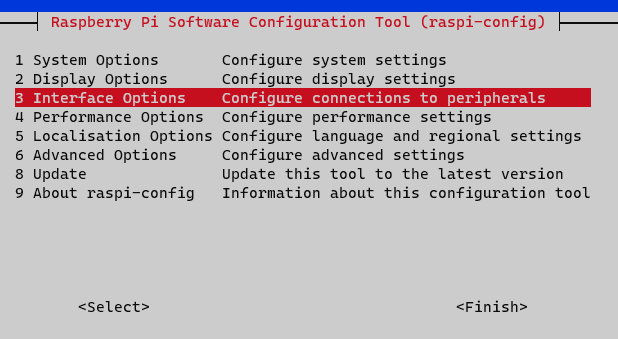
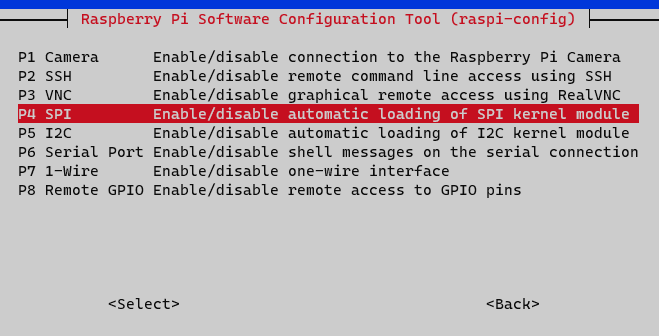
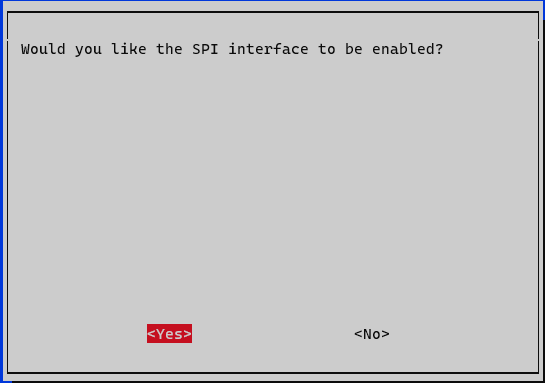
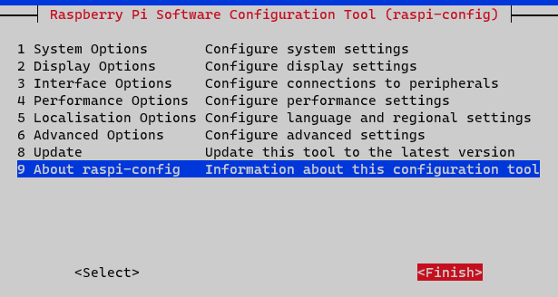
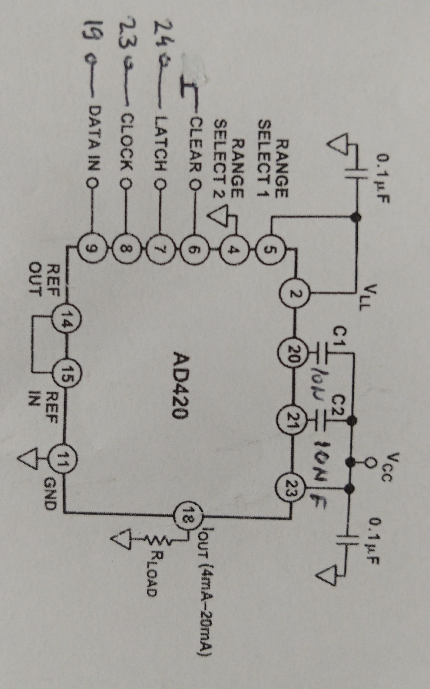
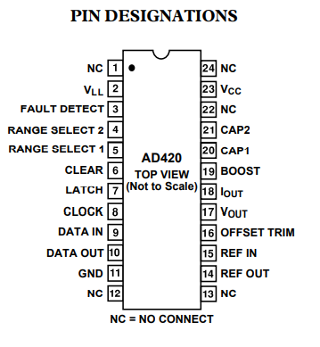

# Current output control with Raspberry PI4 as SPI master for AD420 

## [SPI](https://www.analog.com/en/analog-dialogue/articles/introduction-to-spi-interface.html) is a synchronous, 
master slave communication protocol that supports multiple slaves.

Thanks to the dedicated lines, MOSI and MISO, communication is full duplex meaning that the master and slave can send and receive data at the same time.

The SPI protocol can use 4 wires for communication:
* C̅S̅ - chip select. Used to select the slave. An individual chip select signal for each slave is required from the master.
  * High => Slave is disconnected from the SPI bus
  * Low => Slave is selected
* SCLK - clock signal generated by the master
* MOSI - master out, slave in
* MISO - master in, slave out

## Raspberry PI4 [SPI interface](https://pinout.xyz/pinout/spi)

### Activate SPI

You need to enable SPI support on Raspbian before using it. To do so follow the next steps

1. On a console run `sudo raspi-config`. Navigation can be done using the arrows and `tab` keys. 
Select can be done with the `enter` key.
2. Select the `Interface Option`

3. Then select the `SPI` option

4. Then select the option to enable the protocol

5. A success message will be shown and then you can exit the configuration app


### Pins

By default, the SPI0 interface is activated. So from raspberry pi 4 we will use the following pins:

* C̅S̅ - GPIO 8 (CE0)
* SCLK - GPIO 11
* MOSI - GPIO 10

We will also use GPIO 39 (GND) to have a common ground reference between the PI 4 and the AD420 device

For this application we will not use the MISO line.

## [AD420](https://www.tme.eu/Document/4370352aefbe859cbbca9085c6f21581/ad420anz-32.pdf) SPI interface 

For powering up the AD420 we will use a 12[V] power supply. (Max support is 32[V])

We will also connect AD420 PIN 11 (GND) to the raspberry pi 4 GPIO 39 (GND)

### Circuit



### Pins



For SPI communication we will use the pins:
* C̅S̅ - PIN 7 (LATCH)
* SCLK - PIN 8 (CLOCK)
* MOSI - PIN 9 (DATA IN)

The SPI data port is configured to process data in 8-bit bytes.

## The code

We will implement the sample code in Python 3.9 using the library [Spidev](https://pypi.org/project/spidev/)
Spidev will enable us to communication with SPI devices by using the spidev linux kernel driver.

Initiate the communication
```python
ad420 = spidev.SpiDev()

bus = 0
device = 0
ad420.open(bus, device)

ad420.max_speed_hz = 100000
ad420.lsbfirst = False
```

Configuring the clock
```python
ad420.mode = 0b00
```

Set an output value
```python
ad420.writebytes([0x7f, 0x0])
```

